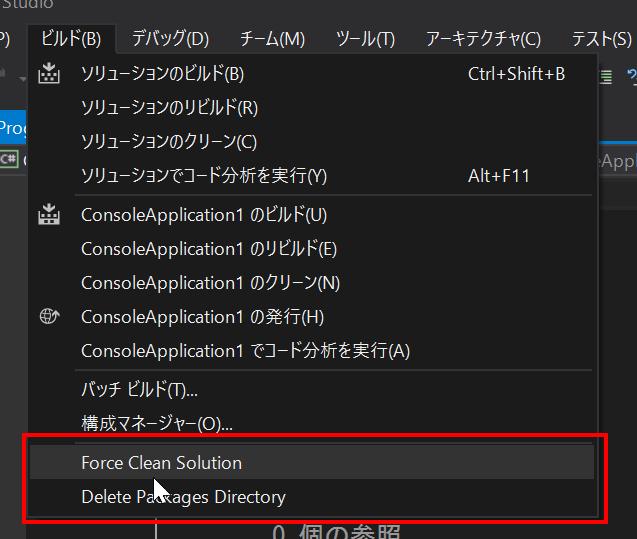

# Force Project Cleaner Addin
Add-in to forcibly clean the Visual Studio project.  
By running, remove the "bin" folder and the "obj" folder directly under all of the projects that exist in the open solutions.  
Also packages directory under the Solution Directory can also be removed from the UI in Visual Studio.  

Please execute and select the "Force Clear Solution" or "Delete Packages Directory" under the "Build" menu.  
Such as during the development of Xamarin, please use when all the build files you want to clean.

[https://visualstudiogallery.msdn.microsoft.com/bc509dde-d3a2-46e0-8f75-f6c814dc727f](https://visualstudiogallery.msdn.microsoft.com/bc509dde-d3a2-46e0-8f75-f6c814dc727f)  